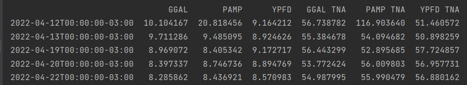
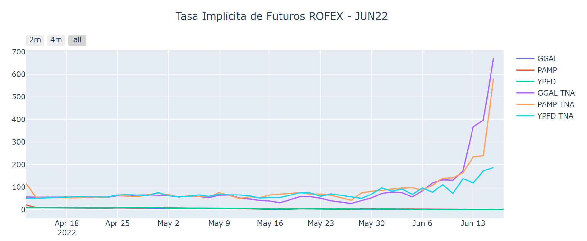
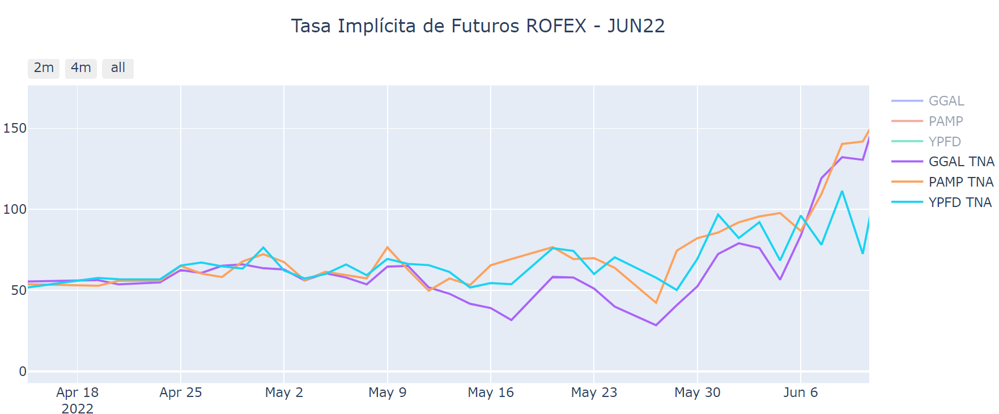

# Tasa Implícita de Futuros ROFEX con PPI API

Gráfico de la tasa implícita de futuros de acciones del mercado PPI.
  
+ Utiliza la API de PPI para obtener la marketdata.

+ Utiliza la librería Plotly para construir los gráficos

Tabla con tasas:

Gráfico general:

Gráfico de las tasas implícitas anualizadas

